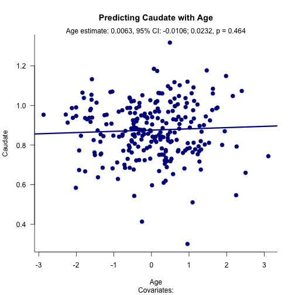
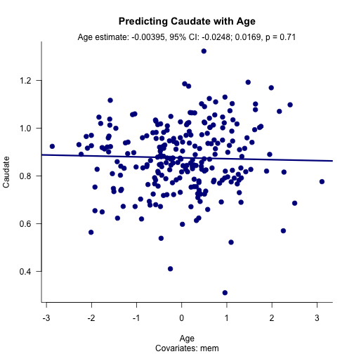

## Linear regression

1. Ordinary least squares linear (OLS) regression is a commonly used statistical analysis approach for evaluating the association between two variables.
2. The association between an outcome (Y) and a predictor (X1) can be determined alone or in the context of covariates (X2, X3, etc.).
3. Inclusion/exclusion of covarites affects the estimated association between Y and X1, sometimes substantially.
4. Visualizing the effects of including/excluding covariates can be tedious.

--- .class #id 

## Visualizing adjusted linear regression: VALR

1. Visualizaing adjusted linear regression (VALR) is a simple app that visualizes the association between two variables (Y, X1).
2. VALR allows the user to easily add or remove additional predictors from the model and re-fit the model.
3. Each time the model is re-fit, the plot updates and reports the estimated association between the selected predictor (X1) and the outcome (Y).
4. There are three parameters to be set:
  + "Brain region" - the outcome parameter
  + "Predictors" - the predictors in the model
  + "Predictor to plot" - the predictor to plot
5. Now we will walk through an example but the app can be found here
  + The app can be found here: https://fishpm.shinyapps.io/project/

--- .class #id

## VALR example

1. In the current example we are trying to predict a measure related to serotonin levels in a brain area called the caudate.

```r
require(lava)
dataset(serotonin, package = 'lava')
serotonin$cau
```

2. We will first evaluate how well age predicts caudate.

3. We will then evaluate how well age predicts caudate with an additional covariate (memory performance).

4. VALR provides an app for evaluating this effect.

--- .class #id

## VALR example

* Here we predict serotonin levels in the caudate with age.

 

--- .class #id

## VALR example

* Note the change when adding memory performance as a covariate.

 

